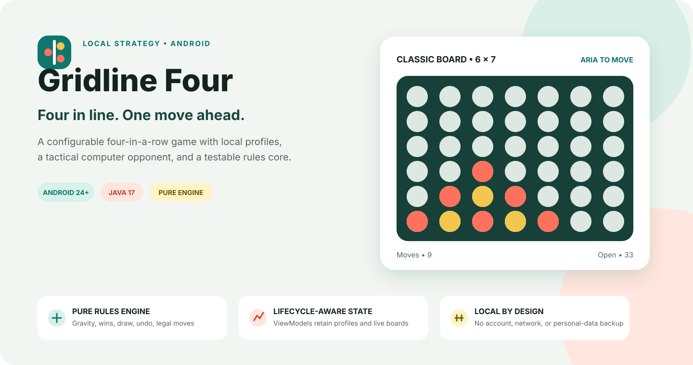
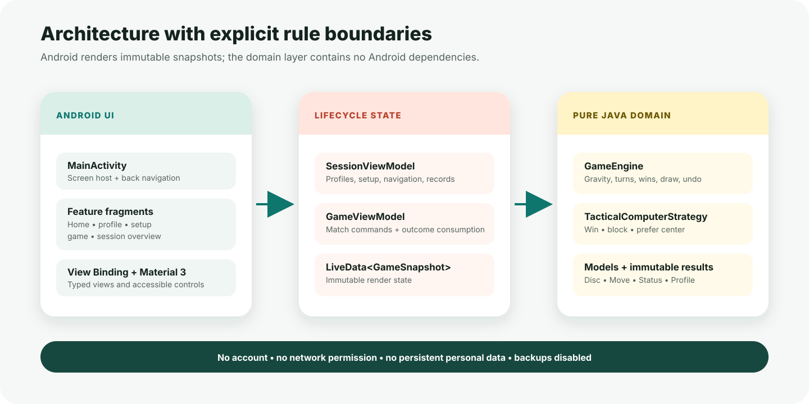

<p align="center">
  
</p>

<p align="center">
  <a href="https://github.com/Himath2002/gridline-four-android/actions/workflows/android-ci.yml"></a>
  
  
  <a href="LICENSE"></a>
</p>

<p align="center">
  <strong>Four in line. One move ahead.</strong><br>
  A local Android strategy game that separates four-in-a-row rules from lifecycle-aware state and Material UI.
</p>

---

## Why Gridline Four

Gridline Four turns a familiar board game into a compact Android architecture case study. Players create local identities, choose a board and disc palette, then play against another person or a deterministic tactical opponent. The application keeps its scope deliberate: no account, network permission, advertising, or hidden persistence.

The engineering focus is equally clear. Gravity, turn order, legal moves, wins, draws, undo, and computer decisions live in a pure Java domain layer. Android components observe immutable snapshots instead of treating view widgets as the source of truth.

### Product highlights

- **Three board formats** — compact 5 × 6, classic 6 × 7, and expanded 7 × 8.
- **Two play modes** — two local players or one player against the tactical computer.
- **Local profiles** — names, six original vector avatars, and session-only results.
- **Two disc palettes** — coral + gold or jade + violet.
- **Reversible local play** — undo the latest move in two-player mode.
- **Session controls** — restart a board, review records, clear statistics, or configure a new match.
- **Adaptive state** — activity-scoped ViewModels retain the active session across configuration changes.
- **Privacy by construction** — no network permission, no personal-data backup, and no database.

## Match journey

| Moment | Player input | Application response |
| --- | --- | --- |
| Profile | Name and one of six avatars | Creates an in-memory local identity |
| Setup | Board size, play mode, and disc palette | Starts a new `GameEngine` with explicit options |
| Turn | Any non-full column | Applies gravity, evaluates the result, and publishes a snapshot |
| Computer turn | A valid player move | Wins if possible, blocks an immediate loss, then prefers the center |
| Session | Resume, reconfigure, clear records, or return home | Preserves intentional session state without writing personal data |

> The repository artwork is original vector illustration derived from the implemented product and architecture. It is explanatory artwork, not a device screenshot.

## Rules and behavior

1. Player one opens the match.
2. Selecting a column places a disc in its lowest available row.
3. Four matching discs horizontally, vertically, or diagonally complete the match.
4. Filling the board without a winning line produces a draw.
5. A rejected move does not change the board or active player.
6. Undo is available only in local-player mode and restores the exact previous turn.
7. Restart clears the board while retaining profiles, options, and session records.

## Architecture

<p align="center">
  
</p>

```text
Material fragments + View Binding
        │ commands / observation
        ▼
SessionViewModel + GameViewModel
        │ immutable GameSnapshot
        ▼
GameEngine + TacticalComputerStrategy
        │
        └── Disc, Move, MoveResult, GameStatus, profile and setup models
```

### Package responsibilities

| Package | Responsibility |
| --- | --- |
| `game` | Pure board state, gravity, win detection, undo, snapshots, and computer strategy |
| `model` | Board, mode, palette, profile, and session-statistics value objects |
| `navigation` | Typed top-level application destinations |
| `viewmodel` | Lifecycle-aware session coordination and engine commands |
| `ui/home` | Profile overview and application entry |
| `ui/profile` | Validated local-profile editing |
| `ui/setup` | Match configuration and precondition checks |
| `ui/game` | Accessible dynamic board rendering and match interaction |
| `ui/session` | Results and deliberate session navigation |
| `ui/common` | Stable mapping from avatar identifiers to vector resources |

### Core design decisions

| Concern | Approach |
| --- | --- |
| Source of truth | `GameEngine` owns the board; views only render snapshots |
| UI state | Activity-scoped `ViewModel` instances expose `LiveData` |
| Mutation safety | `GameSnapshot` and `copyBoard()` return defensive copies |
| Move validity | Invalid, full-column, and completed-game attempts return typed rejections |
| Win detection | Directional counting from the newly placed disc |
| Computer play | Deterministic win → block → center preference strategy |
| Orientation | Fragment views can be recreated while ViewModels retain the session |
| Privacy | In-memory profiles, disabled backups, and no network permission |
| Toolchain | Android 36, API 24 minimum, Java 17, Gradle 9.6.1 |

### Complexity profile

Let `R` be rows and `C` be columns.

| Operation | Time | Additional space |
| --- | ---: | ---: |
| Place and evaluate a disc | `O(R + C)` | `O(1)` excluding retained move history |
| Undo latest move | `O(1)` | `O(1)` |
| Copy a render snapshot | `O(R × C)` | `O(R × C)` |
| Choose a tactical computer column | `O(C × (R + C))` | `O(C)` |
| Retained board + history | — | `O(R × C)` |

## Run locally

### Prerequisites

- Android Studio with Android SDK 36
- JDK 17 or newer
- An emulator or Android device running API 24+

### 1. Clone

```bash
git clone https://github.com/Himath2002/gridline-four-android.git
cd gridline-four-android
```

### 2. Verify

```bash
./gradlew test lint
```

The unit suite exercises gravity, turn order, rejected moves, horizontal/vertical/diagonal wins, undo, defensive snapshots, and the computer strategy. Android lint runs with product warnings treated as errors.

### 3. Build

```bash
./gradlew assembleDebug
```

The debug APK is written to:

```text
app/build/outputs/apk/debug/app-debug.apk
```

### 4. Run

Open the project in Android Studio, choose an API 24+ device, and run the `app` configuration. The application requires no account, service credential, or network connection.

## Project structure

```text
gridline-four-android/
├── .github/workflows/        # Reproducible Android verification
├── app/
│   ├── lint.xml              # Version-notice policy; product warnings stay enabled
│   └── src/
│       ├── main/
│       │   ├── java/io/github/himath2002/gridlinefour/
│       │   │   ├── game/     # Pure rules and strategy
│       │   │   ├── model/    # Session value objects
│       │   │   ├── navigation/
│       │   │   ├── ui/       # Feature-oriented Android screens
│       │   │   └── viewmodel/
│       │   └── res/          # Material layouts and original vector artwork
│       └── test/              # JVM unit tests for domain behavior
├── docs/                     # README visuals
├── CHANGELOG.md
├── CONTRIBUTING.md
├── SECURITY.md
└── README.md
```

## Verification policy

Every proposed change should pass:

```bash
./gradlew --no-daemon clean test lint assembleDebug
```

CI performs the same test, lint, and APK assembly gates on Ubuntu with JDK 17. Dependency and target-version notices are reviewed separately because the repository pins a verified SDK/toolchain; all product-code and resource lint checks remain enabled, and warnings fail the build.

## Intentional scope

Gridline Four is a polished local game and architecture case study. It intentionally does not include online matchmaking, authentication, cloud synchronization, long-term statistics, or a minimax search engine. Those additions would change the product rather than strengthen the current demonstration.

## Provenance

This repository is a portfolio-ready evolution of an earlier Android learning project designed and implemented by the same author. Its current identity, package architecture, pure rules engine, lifecycle state model, tests, vector interface system, documentation, and release workflow were developed for this publication. See [ACKNOWLEDGEMENTS.md](ACKNOWLEDGEMENTS.md) for the concise attribution record.

## License

Gridline Four is available under the [MIT License](LICENSE).
